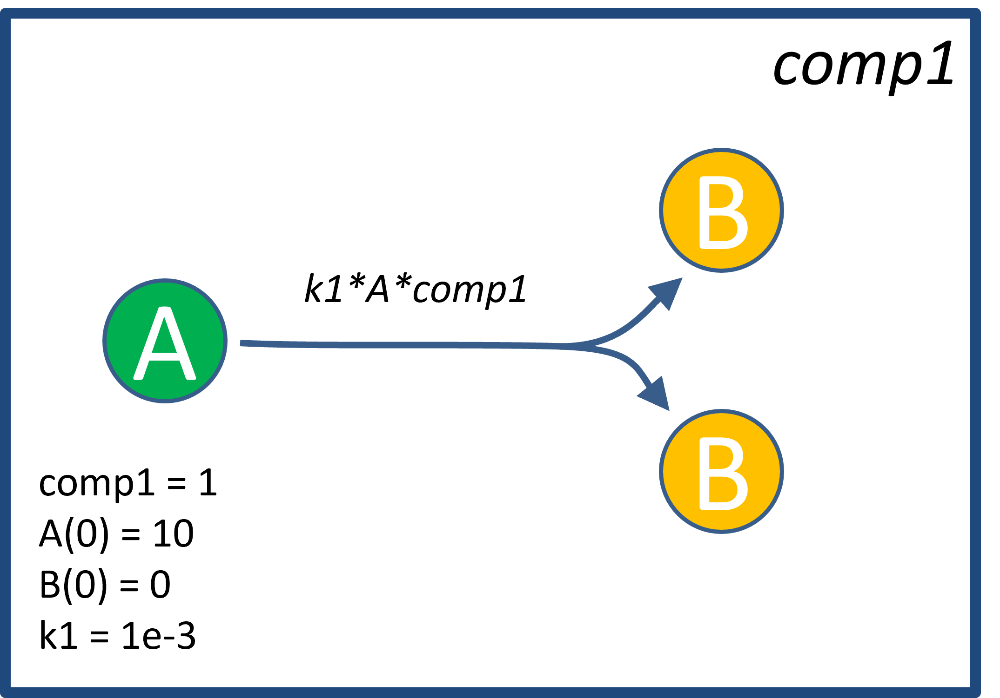

# Summary

Today mathematical modeling is becoming more and more popular in biomedicine and drug development. __Quantitative systems pharmacology__ (QSP), a relatively new research discipline, is devoted to complex models describing organisms, diseases, and drug dynamics. Designing these models presents a set of challenging methodological problems like managing a huge amount of data, dealing with large-scale models, time-consuming calculations, etc. __Heta compiler__ is a small and fast software tool written in JavaScript which manages infrastructure for QSP modeling projects. The purpose of the tool is to build and integrate QSP platform modules, to check their completeness and consistency, and then to compile everything into runnable code that will be executed in simulation software. A user can apply a command-line interface to run the model building process. Alternatively, Heta compiler can be used as a package for developing web-based applications or be integrated with simulation software.

# Statement of need

The large and still growing QSP/SB modeling community utilizes a variety of software tools for simulation and data analysis [@Stephanou2018; @Mentre2020; @Knight-Schrijver2016]. Usually, the modelers solve the algebraic-differential equations or perform parameters identification or sensitivity analysis. While being useful for tackling specific problems, each software tool often has no user-friendly way for routine operations like step-by-step model creation and maintenance. Furthermore, different tools have their own internal model format which cannot be reused.

This paper presents Heta compiler which provides a convenient and flexible way for the development of dynamic large-scale models based on the __Heta language__ code. The compiler translates the source modeling code into a variety of formats to be run in simulation software tools. Heta compiler also provides information on errors in a model which can be used to debug.

This tool is an effort to resolve the typical problems in a QSP project by creating a controllable working environment.
The pre-formulated requirements are:  

-	store QSP models and data in integrated infrastructure, 
-	support iterative platform updates, 
-	support of models written in human-readable formats as well as in tables, 
-	help for model code reuse and sharing,
- provide interface for storing several models in a single platform,
-	export models and data to different popular formats so it can be used out-of-the-box.

# Heta formats

`Heta compiler` has been evolving alongside the Heta language [@metelkin2019] specification. Heta is a series of human-readable and writable formats for QSP and Systems Biology projects: Heta code, table representation, JSON, and YAML notation. Heta describes dynamic models in the process-description format i.e., as interacting components that describe volumes, concentrations, amounts, rates. On the other side, it was designed to be easily transformed into ODEs or other formats.

The standardization of process-description modeling notation was also pursued in formats like SBML, CellML, Antimony. However the Heta standard can be distinguished by the specific features:  

-	Human-readable/writable code that can be used for model development or modification.
-	Easy code parsing.
-	Modularity: QSP/SB platform can be subdivided into several files and spaces for better project management.
- Multiple interchangeable representation: human-readable code, tables, JSON, YAML.
-	Reusability: modeling platforms should be easily extended for other projects.
-	Reach annotation capabilities for better model code revision.
-	Simple transformation to popular modeling formats or general-purpose ODEs.
- Support of translation from/to SBML [@Hucka2003].

## Example

Code in \autoref{fig:model-code} is an example of the Heta code describing a simple one-compartment model. The metabolic scheme of the model can be found in \autoref{fig:model-scheme}.

{ width=60% }

{ width=60% }

When the size of a model code is large it is recommended to subdivide it into modules but this model is small and can be placed into a single file, e.g `index.heta`. To build the platform with `Heta compiler` one can run the compilation with the following command in a command terminal: `heta build`.

# Features overview

`Heta compiler` includes the parser of the Heta formats and supports all features of the [Heta specifications](https://hetalang.github.io/#/specifications/) of version 0.4.1. 
It was designed to support exporting to different popular modeling formats. The current version supports the following formats: 

-	DBSolveOptimum
-	SBML of levels 2 and 3
-	mrgsolve
-	Simbiology
-	Matlab describing ODEs file
-	Julia language code
-	JSON/YAML
-	Excel sheets

`Heta compiler` can work in two modes: as a command-line tool for model development or as a library to be incorporated into third-party applications. 
The source code is written in pure JavaScript and can be run in the Node environment or in a browser.
It can be used for both: server-side and front-end applications.

To use `Heta compiler` in a modeling project a user should follow the specific formats and agreements.
Project files i.e. model code, datasets, figures, etc. should be stored in the same directory.
This directory typically includes an optional `platform.json` declaration file that stores the supplementary information of a platform as well as specific parameters for platform compilation.
The alternative way to set the options of the compiler is to use command-line arguments.
The list of them can be shown with `heta build -h` command in a shell.

# Results and discussion

`Heta compiler` can be used as the framework for a QSP modeling project of any size and complexity.  Currently, it is applied for the development and maintenance of a variety of commercial and open-source modeling projects [@faah; @covid].
`Heta compiler` has also been used for the development of web applications like the [Immune Response Template](https://irt.insysbio.com/) navigator and "PK/RO simulator" R-Shiny application [@mAb-app].

The Heta-based formats are friendly for version control systems like Git and SVN because of the modular structure and the text-based representation.
Heta compiler can easily be integrated with existing modeling infrastructure, workflows or used as a part of a CI/CD workflow.

`Heta compiler` is a part of the Heta project which is an initiative for the development of full-cycle infrastructure for modeling in pharmacology and biology: <https://hetalang.github.io>.

# References
