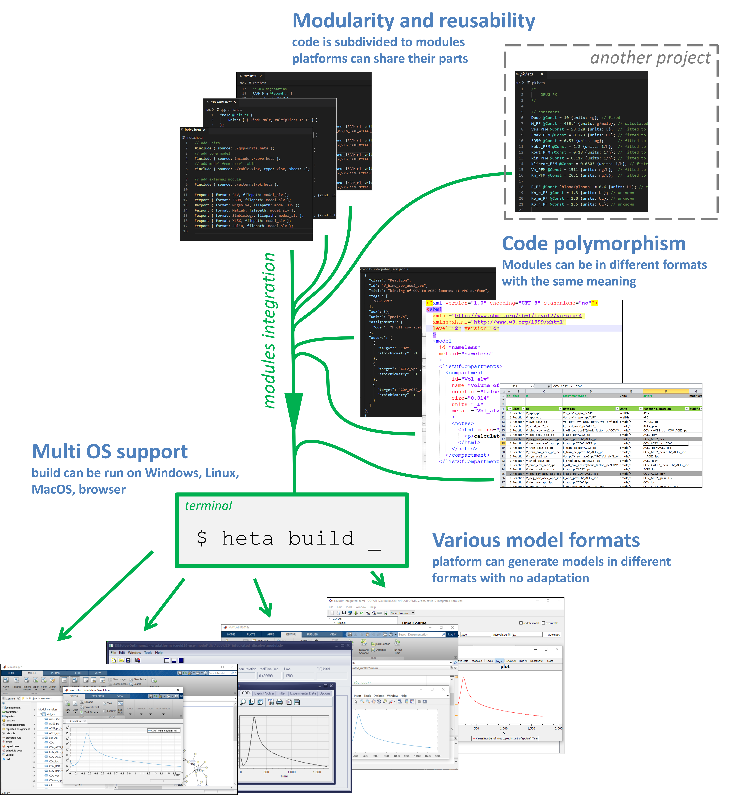

# Summary

Today the mathematical modeling is becoming more and more popular in biomedicine and drug development. Quantitative systems pharmacology (QSP) been a relatively new research discipline is devoted to complex models describing organisms, diseases and drug dynamics. __Heta compiler__ is a small and fast software tool which manages infrastructure for modeling projects. The mission of the tool is to build and integrate QSP platform modules, to check its completeness and consistency and then to compile the runnable code that will be executed in a simulation software. Furthermore, Heta compiler provides the information about errors in a model that can be used for debugging process. A user can use command line interface to run the model building process. The core of Heta compiler was developed in JavaScript language and can be used in Node environment. Alternatively, Heta compiler can be used as a part of a web-based application or be integrated with a simulation software.

# Statement of need

The large and still growing the QSP/SB modeling community utilizes a variety of software tools for simulation and data analysis [@Stephanou2018; @Mentre2020; @Knight-Schrijver2016]. Usually they solve the algebraic-differential equations or problems that are based on ODE solutions like parameters identification or data analysis. Having good facilities on tackling specific tasks a particular software often has no user-friendly format for routine operations like model creation and development. Furthermore, different tools have their own internal model format which cannot be reused in another tool.

This paper presents Heta compiler which provides the convenient and flexible way for the development of dynamic large-scale models based on the Heta language code. Moreover, the compiler translates the source modeling code into variety of formats to be run in simulation software tools.

This study is an effort to resolve the typical problems in a QSP project by creating the software infrastructure based on Heta formats and develop a shared and controllable working environment. The pre-formulated requirements are: 
-	storing the QSP models and data in integrated infrastructure, 
-	support iterative platform updates, 
-	support of models written in human-readable text and table formats, 
-	support for model code reuse and sharing, 
-	export models and data to different popular formats on the fly.

# Heta formats

`Heta compiler` has been evolving alongside the Heta language which is a domain specific language (DSL) designed for the development and annotation of dynamical models in QSP projects. Heta describes dynamic models in the process-description format i.e., as interacting components that describe volumes, concentrations, amounts, rates.

Features:
-	Human-readable/writable code can be used for model creation, modification, or integration. 
-	Easy code parsing and transformation for potential implementation into different tools and frameworks.
-	Modularity: QSP platform can be subdivided into several files and spaces for better project management.
-	Reusability: modeling platforms should be easily extended for other projects.
-	Reach annotation capabilities for better code revision and reporting.
-	Simple transformation to popular modeling formats or general purpose ODEs.

SBML language [@Hucka2003], Antimony [@Smith2009].

# Example

Scheme of the model can be found in \autoref{fig:model-scheme}

```heta
/*
  Simple model
*/
comp1 @Compartment .= 1;
A @Species { compartment: comp1 };
B @Species { compartment: comp1 };
r1 @Reaction { actors: A => 2B };

// math
A .= 10;
B .= 0;
r1 := k1*A*comp1;

k1 @Const = 1e-3;

#export { format: SBML, filepath: sbml };
#export { format: Mrgsolve, filepath: mrgsolve };

```

{ width=60% }

```sh
> heta build

```

# Feature overview

`Heta compiler` was created to support exporting to different popular modeling formats. One of the main development effort is to extend a list of supporting formats and allow people to have the same results working in different tools. The current version supports the following formats:
-	DBSolveOptimum .SLV files
-	SBML L2/L3
-	mrgsolve .CPP files
-	Simbiology’s .M files
-	Matlab describing ODEs file
-	Julia language code
-	JSON/YAML
-	Excel sheets
-	Human-readable Heta code



# Results and discussion

`Heta compiler` can be used as the framework for a QSP modeling project of any size and complexity. It allows integrate the dynamical models and data as modules and transform the modeling code to different popular formats. The Heta-based formats are friendly for version control systems like Git and SVN because of the modular structure and the text-based representation. Usage of a version control system add benefits to the modeling workflow:
-	Storing of a platform history and results with important steps.
-	Controllable and manageable code sharing with the remote synchronization.
-	Working tasks distribution and delegation.
-	Usage of automatization facilities (CI/CD) like GitHub actions, GitLab runner, etc.
-	Delivery of results to users/clients.
It can be easily integrated with existed infrastructure, workflows or used as a part of the CI/CD strategy.

Currently `Heta compiler` is intensively utilized for the development and maintenance of variety of commercial and open-source modeling projects [@faah; @covid]. It was tested and demonstrates its effective especially for the large-scale models (1000 dynamic components and more).

`Heta compiler` has also been used for the development of web applications like the Immune Response Template database navigator [@irt] and “PK/RO simulator” R-Shiny application [@mAb-app].

`Heta compiler` is a part of the Heta project which is an initiative for the development of full-cycle infrastructure for modeling in pharmacology and biology: <https://hetalang.github.io>.

# References
